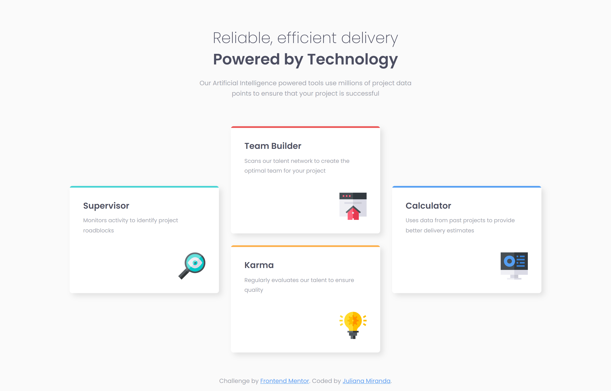

# Frontend Mentor - Four card feature section solution

This is a solution to the [Four card feature section challenge on Frontend Mentor](https://www.frontendmentor.io/challenges/four-card-feature-section-weK1eFYK). Frontend Mentor challenges help you improve your coding skills by building realistic projects. 

## Table of contents

- [Overview](#overview)
  - [The challenge](#the-challenge)
  - [Screenshot](#screenshot)
  - [Links](#links)
- [Author](#author)

## Overview

### The challenge

Users should be able to:

- View the optimal layout for the site depending on their device's screen size

### Screenshot

### Links

- Solution URL: [Frontend Mentor](https://www.frontendmentor.io/solutions/four-card-feature-section-html-and-css-QIhLMM0Br-)
- Live Site URL: [Github Pages](https://jumiranda5.github.io/fm-four-card-feature/)

## Author

- Frontend Mentor - [@jumiranda5](https://www.frontendmentor.io/profile/jumiranda5)
